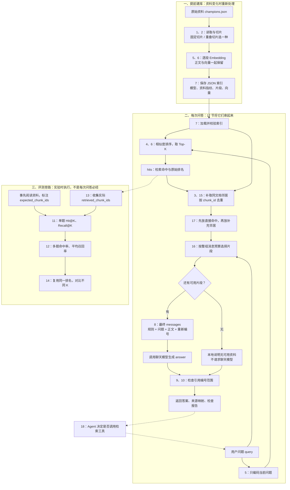

# 第八章总览：把所有小节放回一条 RAG 流程

这份文档是第八章的总入口。先看概念图，再按需要回看单节；不必按文件创建顺序猜程序执行顺序。

## 1. 先记住这句话

**提前把资料做成向量索引；提问时找资料、整理资料，再让模型依据资料回答。评测单独检查这些步骤做得怎样。**

你已经写过的大部分小节，只是在为这条流程准备可复用函数，并不是十几套不同系统。

## 2. 顺序关联概念图

图中实线表示数据执行顺序，虚线表示评测或集成关系。进度更新：第 17 节已完成并验收三类真实样例，第 18 节已完成一次真实工具问答，基础练习收尾。



如果本地 Markdown 阅读器不渲染 Mermaid，可直接在 GitHub 的 Markdown 页面查看，或先读以下等价顺序：

- 建库：原资料 → 切片 → 资料 Embedding → 保存索引。
- 问答：问题 Embedding + 加载索引 → Top-K → 邻居扩展去重 → 确定优先级 → 预算选择 → 最终消息 → 生成 → 引用检查。
- 评测：人工标注 + 原始检索排名 → 单题指标 → 多题汇总 → 不同 K 对比。

图中“预算选择”和“消息组装”相互配合：选择每一段时就要构造候选消息来计数；全部选好后再得到最终发送的那组消息。不是选完正文后才第一次计算消息开销。

## 3. 各小节到底负责什么

以下代码链接相对于本总览，点击可打开对应文件。

### A. 资料准备与检索

| 节 | 内容与文件 | 输入 → 输出 | 和下一步的关系 |
| --- | --- | --- | --- |
| 1 | [固定长度切片](../../src/agent_learning/module_08_rag/document_chunking.py) | 原始英雄资料 → 文档 → 片段字典 | 给资料编码准备文本 |
| 2 | [重叠切片](../../src/agent_learning/module_08_rag/overlapping_chunking.py) | 文档、chunk_size、overlap → 重叠片段 | 当前索引采用的切分方式，与第 1 节不是必须串行执行 |
| 3 | [单命中邻居扩展](../../src/agent_learning/module_08_rag/neighbor_expansion.py) | 全部片段、命中 ID、window → 同文档邻居 | 当时手动指定命中，第 15 节用于多条真实格式命中 |
| 4 | [余弦相似度](../../src/agent_learning/module_08_rag/embedding_basics.py) | 问题向量、片段向量 → 分数与排名 | 是第 6 节检索的数学部分 |
| 5 | [真实 Embedding](../../src/agent_learning/module_08_rag/real_embeddings.py) | 一段文本 → 数字向量 | 建库编码资料，查询编码问题 |
| 6 | [Top-K 检索](../../src/agent_learning/module_08_rag/top_k_retrieval.py) | query_vector、index、K → hits | hits 保留 chunk 和 score |
| 7 | [索引保存复用](../../src/agent_learning/module_08_rag/index_persistence.py) | 索引字典 ↔ 本地 JSON | 查询不再反复给全部资料生成向量 |

### B. 回答与来源检查

| 节 | 内容与文件 | 输入 → 输出 | 边界 |
| --- | --- | --- | --- |
| 8 | [组装消息与回答](../../src/agent_learning/module_08_rag/rag_answering.py) | 问题、资料 → messages → answer | 聊天模型读正文，不读 embedding 数字 |
| 9 | [引用编号校验](../../src/agent_learning/module_08_rag/citation_checks.py) | answer、实际来源数 → 编号报告 | 编号存在不等于正文支持答案 |
| 10 | [生成与检查组合](../../src/agent_learning/module_08_rag/checked_rag_answer.py) | 问题、hits、generate → 回答及报告 | 你反馈在家已完成，本机仍是旧 TODO；不重复改它 |

### C. 检索评测旁路

| 节 | 内容与文件 | 输入 → 输出 | 解决的问题 |
| --- | --- | --- | --- |
| 11 | [单题评测说明](11-检索评测-Hit与Recall.md) | 预期 ID、实际排名、K → Hit@K、Recall@K | 有没有命中、找回多少；实现已整理到第 12 节文件 |
| 12 | [多题汇总](../../src/agent_learning/module_08_rag/retrieval_evaluation.py) | 多题记录 → 命中率、平均召回率、详情 | 不把多道题的片段混为一个分母 |
| 13 | [固定问题集与结果收集](../../src/agent_learning/module_08_rag/retrieval_benchmark.py) | 标注题、retrieve → 带实际排名的题目 | 可以连接真实检索，但目前仅完成离线验证 |
| 14 | [不同 K 对比](../../src/agent_learning/module_08_rag/retrieval_k_comparison.py) | 同一批题、多个 K → 多份报告 | 每题只取一次最大 K，再比较排名前缀 |

### D. 上下文准备与最终整合

| 节 | 内容与文件 | 输入 → 输出 | 当前状态 |
| --- | --- | --- | --- |
| 15 | [多命中扩展去重](../../src/agent_learning/module_08_rag/context_expansion.py) | 全部 chunks、hits → 不重复的完整片段 | 10 个离线测试已通过 |
| 16 | [上下文预算](../../src/agent_learning/module_08_rag/context_budget.py) | 候选片段、预算、计数器 → 最终片段与 messages | 12 个离线测试已通过；演示计数是字符，不是真实 Token |
| 17 | [完整问答综合题](../../src/agent_learning/module_08_rag/rag_pipeline.py) | 问题 + 可替换检索/生成函数 → 答案、来源、预算与引用报告 | 已完成；[三类真实验收结果](17-完整RAG与真实验收.md) |
| 18 | [Agent 检索工具](../../src/agent_learning/module_08_rag/rag_search_tool.py) | Agent 工具请求 → 检索结果回到工具循环 | 已完成；[单次真实验收与边界](18-把检索接成Agent工具.md) |

## 4. 五种数据结构不要混淆

```python
# 1. 一个片段：正文与描述信息
chunk = {
    "chunk_id": "A_001",
    "document_id": "A",
    "text": "资料正文",
    "metadata": {"chunk_index": 1},
}

# 2. 一个索引记录：片段加上向量
index_record = {**chunk, "embedding": [0.1, 0.2]}  # 向量仅示意

# 3. 一个检索命中：外层多了 score
hit = {"chunk": index_record, "score": 0.8}

# 4. 发给聊天模型的消息：文本，不是向量
message = {"role": "user", "content": "问题……参考资料：[1] 正文……"}

# 5. 一条评测记录：预期与实际 ID 放在一起
case = {
    "case_id": "q1",
    "query": "问题",
    "expected_chunk_ids": ["A_001"],
    "retrieved_chunk_ids": ["B_000", "A_001"],
}
```

chunks 是片段列表，hits 是命中列表。hit['chunk']['chunk_id'] 比 chunk['chunk_id'] 多了一层，不是同一种取法。

邻居扩展后的片段没有新计算相似度，不给它们随意复制 score。组装消息时用 {"chunk": chunk} 包装，现有格式化函数不依赖 score。

## 5. 用一条问题串起来看

以下全部是离线示例，不是已执行的真实模型结果。

输入问题：“练习角色为什么选择示例地区？”

```text
原始检索命中：A_001
A_001 正文：他最终选择住在示例地区，原因如下。
补取邻居后：A_000、A_001、A_002
A_002 正文：原因是当地设有图书馆，便于学习。
```

第 17 节明确采用“直接命中优先、补充邻居在后”的预算优先级：

```text
候选顺序：A_001、A_000、A_002
假设预算都放得下：三段都保留
来源编号：[1] A_001、[2] A_000、[3] A_002
```

整理成 messages 后交给 generate。离线假生成器预设返回：

```text
根据学习资料，他选择那里是因为当地有图书馆，便于学习。[3]
```

编号检查用最终 source_count=3，所以 [3] 有效。但这个检查器不会理解正文是否真的支持句子；离线例子的语义依据由人阅读核对。

预算不足可能把 A_002 删掉，这时只保留别的片段不代表有答案。真实生成还必须遵守资料不足时说明的规则，后续需要用真实案例验收，不能靠编号检查推断答案正确。

## 6. 三个容易混淆的参数

| 参数 | 控制什么 | 不是什么 |
| --- | --- | --- |
| chunk_size / overlap | 建库时如何切文本、重复多少字符 | 不是一次检索返回多少条 |
| top_k | 原始检索取前多少个片段 | 不是英雄数量，也不是最终发送条数 |
| window | 每条命中前后补多少个同文档片段 | 不是上下文窗口的 Token 上限 |

input_budget 则控制最终输入消息大小。当前演示单位是字符；真实 Token 预算需要对应模型的计数方式。预留输出、安全余量与模型限制需要在真实请求配置中一致考虑。

## 7. 哪些会调用模型，哪些只是本地操作

- 资料 Embedding：首次建库或更新资料时请求；现有建库脚本逐段调用。
- 问题 Embedding：真实检索时请求；读取缓存不自动缓存所有问题向量。
- 聊天生成：有最终可用资料时调用 generate；离线测试传入假函数就不会请求。
- 文件读取、相似度排序、邻居扩展、去重、预算选择、指标计算、编号检查：当前都在本地完成。

假客户端或假函数替换的是外部服务边界，其他函数仍可以执行真实代码。测试通过只说明被检查的代码行为符合约定，不代表外部服务或回答质量已被验证。

## 8. 当前进度：已验证与未验证分开看

- 真实 Embedding 已验证，现有 14 段、1024 维索引已保存并做过真实单问题缓存检索。
- 第 8～9 节消息组装与编号检查通过离线测试。
- 第 10 节按你的反馈在家完成；本机尚未同步，不用改旧文件重新做。
- 第 11～16 节计算、收集、对比、扩展和预算逻辑已分别验证。
- 第 17 节完整真实生成已验收三类样例：单资料、多资料、资料不足。实际 3 次问题 Embedding + 3 次聊天；字符预算不是精确 Token 预算。详见 [验收记录](17-完整RAG与真实验收.md)。
- 第 13 节固定问题集的真实检索指标评测尚未执行，不与第 17 节样例验收混为一谈。
- 英雄资料并未逐条事实核验；不能把链接或编号当成正确性的证据。
- 向量数据库、混合检索、独立重排模型留到项目需要时学，不为此继续延长本章。

## 9. 第 17 节只出一道综合题

打开 [rag_pipeline.py](../../src/agent_learning/module_08_rag/rag_pipeline.py)，完成 run_rag 的三个 TODO。你要做的是连接现成函数，而不是再实现底层算法。

输入：query、全部 chunks、retrieve 函数、generate 函数、输入预算、计数器，以及 top_k、window。

1. 调用 retrieve(query, top_k) 得到 hits，再调用 expand_context_chunks 补邻居去重。
2. 用已写好的 prioritize_hits 把直接命中放前面，再调用 select_context 得到最终 selection。
3. 调用已写好的 finish_run，返回完整报告。

finish_run 负责：只把 selection['messages'] 交给 generate；无命中或无片段放得下时不调用生成器；保留原回答并检查引用；返回原始命中 ID、最终来源 ID、跳过 ID、消息和计数。

不要再调用 answer_from_hits 重建消息，否则容易绕过已确认的预算选择。第十节旧文件不会参与本题，不需要同步后才能练习。

输出包括：

```python
{
    "status": "generated",   # 表示执行了生成，不代表事实验证通过
    "answer": "根据学习资料……[3]",
    "retrieved_ids": ["A_001"],
    "source_ids": ["A_001", "A_000", "A_002"],
    "omitted_ids": [],
    "source_count": 3,
    "messages": [...],
    "input_size": 实际计数,
    "input_budget": 输入预算,
    "citation_check": {...},
}
```

无命中时 status=no_retrieval；有命中但没有片段放得下时 status=no_context。两者不是“确认全库没有答案”。生成器抛异常时向上传播，不伪装成正常报告、不自动重试。

先运行离线测试：

```bash
PYTHONPATH=src .venv/bin/python -m pytest src/agent_learning/module_08_rag/test_rag_pipeline.py -q
```

完成后运行示例，看检索输入、最终发送的 user 消息和完整报告：

```bash
PYTHONPATH=src .venv/bin/python -m agent_learning.module_08_rag.rag_pipeline
```

上方综合题已完成。真实验收入口为 [rag_live_acceptance.py](../../src/agent_learning/module_08_rag/rag_live_acceptance.py)，三类样例结果及接下来的理解题见 [第十七节文档](17-完整RAG与真实验收.md)。不为每个案例新增一节。

## 10. 复习顺序建议

先按“7 → 5 → 6 → 15 → 16 → 8 → 9”口述一遍在线问答流程，再看“11 → 12 → 13 → 14”评测旁路。能说清每一步输入和输出后，就直接做第 17 节，不需要重写前 16 节。
